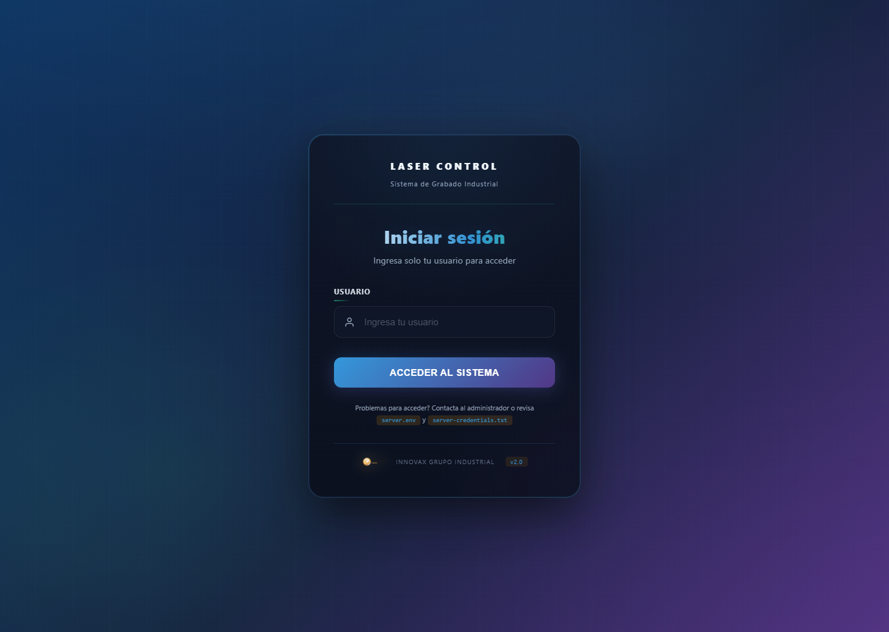
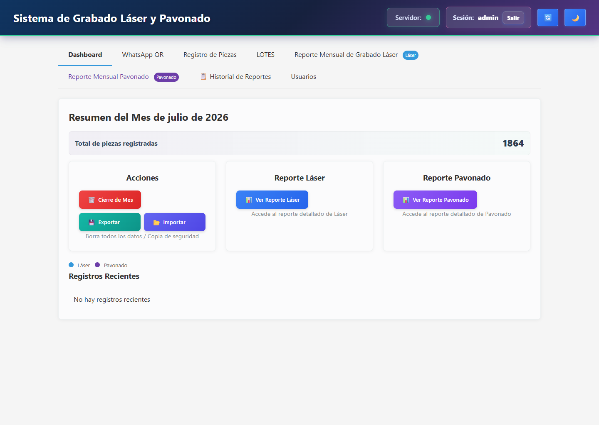

# Registros Automáticos

Aplicación local/LAN para captura operativa de producción desde WhatsApp, administración de lotes y piezas, y generación de reportes mensuales con interfaz web y launcher de escritorio.

## Stack

- `Node.js + Express`
- `SQLite` para operación local
- `MSSQL` para despliegues avanzados
- `whatsapp-web.js` y `Baileys`
- `Electron` para distribución en Windows
- Frontend HTML/CSS/JS

## Capturas de UI

### Login



### Dashboard



## Qué hace

- Captura registros operativos desde WhatsApp
- Gestiona lotes y piezas manuales
- Genera reportes mensuales de grabado láser y pavonado
- Permite exportar, importar, respaldar y restaurar datos
- Corre en red local sin depender de un despliegue cloud

## Modos soportados

- Recomendado para piloto/operación: `Electron + Node + SQLite + LAN/on-prem`
- `MSSQL` disponible para instalaciones con infraestructura existente
- No es un SaaS internet-first

## Arranque rápido

### Web / Node

1. Instala dependencias:

```powershell
npm install
```

2. Crea configuración local:

```powershell
Copy-Item .\server.env.example .\.env
```

3. Define como mínimo:

- `AUTH_SECRET`
- `RESET_PASSWORD`
- `AUTH_ADMIN_USER`
- `AUTH_ADMIN_PASSWORD`

4. Inicia:

```powershell
npm start
```

5. Abre:

- `http://127.0.0.1:3000/login`

## Autenticación

- `AUTH_ENABLED=true` por defecto
- El sistema soporta modo `solo usuario` con `AUTH_REQUIRE_PASSWORD=false`
- Si `AUTH_REQUIRE_PASSWORD=true`, exige usuario y contraseña
- `/status` y `/qr` quedan detrás de sesión

## Desktop / Electron

- El paquete no embebe `.env` ni sesiones de WhatsApp
- En el primer inicio genera por máquina:
  - `%LOCALAPPDATA%\LaserControl\server.env`
  - `%LOCALAPPDATA%\LaserControl\server-credentials.txt`
  - `%LOCALAPPDATA%\LaserControl\backups\`
  - `%LOCALAPPDATA%\LaserControl\logs\server.jsonl`
- La base de datos local por defecto queda en `%LOCALAPPDATA%\LaserControl\laser_engraving.db`

## Build Windows

```powershell
node .\desktop\build-package.js
```

Salida principal:

- `dist\LaserControl-win32-x64\LaserControl.exe`

## Validación

```powershell
npm test
```

Gate de release:

```powershell
npm run release:check
```

## Endpoints útiles

- `GET /healthz`
- `GET /readyz`
- `GET /api/backups`
- `POST /api/backups`
- `POST /api/import`
- `GET /api/export`

## Documentación adicional

- [Manual de usuario](docs/MANUAL_USUARIO.md)
- [Playbook operativo](docs/OPERATIONS_PLAYBOOK.md)
- [API de WhatsApp](docs/WHATSAPP_API.md)
- [Contexto del proyecto](docs/GUIA_ENTREVISTA_PROYECTO.md)

## Estado técnico

- El backend principal sigue concentrado en `server.js`
- La UI principal es funcional, pero todavía pesada y con deuda estructural
- El foco actual es estabilidad operativa, empaquetado usable y soporte en entorno real
